  

  

# Hi there, I'm Muhammad Awais! 👋

I am a passionate **Data Science Student** in my 6th semester at the **Islamia University of Bahawalpur (IUB)**[cite: 1]. I love turning raw data into smart, actionable insights and building practical machine learning solutions. 

Beyond coding, I've served as a **Class Representative (CR)** for a year[cite: 1], which helped me build strong communication, team coordination, and leadership skills[cite: 1].

### 🚀 What I Do
- 📊 **Data Prep & Analysis:** Building pipelines to clean and automate data workflows.
- 🤖 **Machine Learning & NLP:** Training classifiers to solve real-world detection problems.
- 📈 **Deep Learning:** Experimenting with LSTMs and Attention Mechanisms for time-series forecasting.
- 💻 **Web Apps:** Creating clean, interactive user interfaces using Streamlit.

---

### 🛠️ My Toolbox

<table>
  <tr>
    <td align="center" width="96">
      
       Python
    </td>
    <td align="center" width="96">
      
       C++
    </td>
    <td align="center" width="96">
      
       SQL
    </td>
    <td align="center" width="96">
      
       Git
    </td>
    <td align="center" width="96">
      
       GitHub
    </td>
  </tr>
</table>

**Libraries & Tools:** 
`Pandas` | `NumPy` | `Scikit-Learn` | `Streamlit` | `PowerBI` | `Excel`

---

### 📁 Featured Projects

#### 📈 [Hybrid Deep Learning Stock Predictor](https://github.com/your-username/your-repo-name)
- **What it is:** An advanced AI model designed to predict stock market prices and trends.
- **Tech Stack:** Python, LSTM, Attention Mechanisms, ANN, NumPy, Pandas[cite: 1].
- **Key Highlight:** Integrated temporal attention mechanisms to significantly boost forecasting accuracy[cite: 1].

#### 🛡️ [SpamGuard: Intelligent Message Filter](https://github.com/your-username/your-repo-name)
- **What it is:** A real-time web application that automatically detects and filters out spam messages.
- **Tech Stack:** Python, Streamlit, Scikit-Learn, Pandas[cite: 1].
- **Key Highlight:** Features a smooth, interactive Streamlit UI for instant message testing[cite: 1].

#### ⚙️ [Smart Data Preprocessing Pipeline](https://github.com/your-username/your-repo-name)
- **What it is:** A web utility tool that cleans and prepares raw, messy data files automatically.
- **Tech Stack:** Python, Streamlit, Pandas, NumPy[cite: 1].
- **Key Highlight:** Automates missing value handling and dataset cleaning in just a few clicks[cite: 1].

### 🏆 Certifications & Learning
- **Introduction to Data Science in Python** — *DataCamp*
- **Understanding Data Science** — *DataCamp*

### 🤝 Let's Connect!
- 💼 Connect with me on [LinkedIn](https://linkedin.com/in/muhammad-awais) 
- 📧 Reach out via Email: `awaisarain12h@gmail.com`

*“Data is the new science. Relation is the new equations.”*
